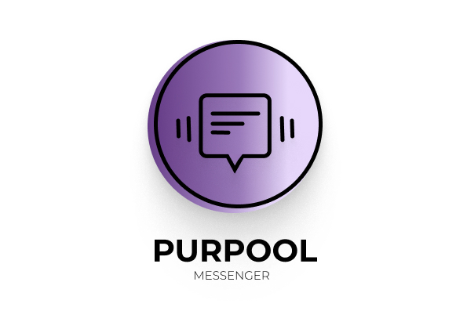

<a name="readme-top"></a>

<div align="center">


</div>
<!-- TABLE OF CONTENTS -->

# 📗 Table of Contents

- [📗 Table of Contents](#-table-of-contents)
- [📖 Book-a-room App ](#-Purpool-Chat-Application)
  - [Live Demo](#live-demo)
  - [🛠 Built With ](#-built-with-)
    - [Tech Stack ](#tech-stack-)
    - [Key Features ](#key-features-)
  - [💻 Getting Started ](#-getting-started-)
    - [Prerequisites](#prerequisites)
    - [Setup](#setup)
    - [Install](#install)
    - [Usage](#usage)
    - [Run tests](#run-tests)
  - [👥 Authors ](#-authors-)
  - [📋 Kanban Board 📋](#-kanban-board-)
  - [🔭 Future Features ](#-future-features-)
  - [🤝 Contributing ](#-contributing-)
  - [⭐️ Show your support ](#️-show-your-support-)
  - [🙏 Acknowledgments ](#-acknowledgments-)
  - [❓ FAQ (OPTIONAL) ](#-faq-optional-)
  - [📝 License ](#-license-)

<!-- PROJECT DESCRIPTION -->

# Purpool Chat Application <a name="about-project"></a>

> Welcome to the Purpool Chat Application! This project is a modern, user-friendly chat application built with React and Firebase


### Live Demo

[Live Demo Link](#)

## 🛠 Built With <a name="built-with"></a>

### Tech Stack <a name="tech-stack"></a>

<details>
  <summary>Client</summary>
  <ul>
    <li><a href="https://github.com/microverseinc/linters-config/tree/master/ror">Linters</a></li>
    <li><a href="https://react.dev/">React.js</a></li>
    <li><a href="https://redux.js.org/">Redux</a></li>
  </ul>
</details>
<details>
  <summary>Server</summary>
  <ul>
    <li><a href="https://rubyonrails.org/">ROR</a></li>
  </ul>
</details>

<details>
<summary>Database</summary>
  <ul>
    <li><a href="https://www.postgresql.org/">PostgreSQL</a></li>
  </ul>
</details>

<!-- Features -->

### Key Features <a name="key-features"></a>

```
- User Authentication: Secure login and signup pages for user authentication. 
- Main Chat Interface: A dynamic and interactive main chat page where users can communicate seamlessly.
```

<p align="right">(<a href="#readme-top">back to top</a>)</p>

## 💻 Getting Started <a name="getting-started"></a>

### Prerequisites

In order to run this project you need: Configure your code editor with HTML , CSS & JS and some other important extensions

### Setup

```
git clone https://github.com/atok624/Purpool-Chat-Application
```

### Install

Install this project with:

```
git clone https://github.com/atok624/Purpool-Chat-Application
```

### Usage

To run the project, execute the following command:

```
  cd Purpool-Chat-Application

  npm install

  npm run dev
```

### Run tests

- Not available for now

<p align="right">(<a href="#readme-top">back to top</a>)</p>

<!-- AUTHORS -->

## 👥 Authors <a name="authors"></a>

👤 **Nicholas Amissah 💻**

- GitHub: [@atok624](https://github.com/atok624)
- Twitter: [@atok624](https://twitter.com/mysticalamissah)
- LinkedIn: [@atok624](https://linkedin.com/in/nicholas-amissah-153b09154)

- 👤 **Gideon Agyage 💻**
- 👤 **Godwin Ahiable 💻**
- 👤 **Jessica Oppong 💻**
- 👤 **Reuben Idan 💻**
- 👤 **Frances Obaze 💻**

<p align="right">(<a href="#readme-top">back to top</a>)</p>

## 📋 Kanban Board 📋

``` There are 6 contributors for this project:```

-  ### [Reuben Idan](https://github.com/reuben-idan)
-  ### [Nicholas Amissah](https://github.com/atok624)
-  ### [Frances Obaze](https://github.com/FranObaze)
-  ### [Gideon Agyage](https://github.com/gideonagyage)
-  ### [Jessica Oppong](https://github.com/Amankwaa97)
-  ### [Godwin Ahiable](https://github.com/Godwinkay)

-  ### Here is the link to the final view Kanban board, showing the various tasks in this project [Final Kanban board](https://github.com/users/Mov305/projects/5)

<p align="right">(<a href="#readme-top">back to top</a>)</p>

<!-- FUTURE FEATURES -->

## 🔭 Future Features <a name="future-features"></a>

- **Signup page**
- **Login page**
- **Main page**

<p align="right">(<a href="#readme-top">back to top</a>)</p>

<!-- CONTRIBUTING -->

## 🤝 Contributing <a name="contributing"></a>

Contributions, issues, and feature requests are welcome!

Feel free to check the [issues page](../../issues/).

<p align="right">(<a href="#readme-top">back to top</a>)</p>

<!-- SUPPORT -->

## ⭐️ Show your support <a name="support"></a>

If you like this project, please clone it and try it. I know you're going to love it

<p align="right">(<a href="#readme-top">back to top</a>)</p>

<!-- ACKNOWLEDGEMENTS -->

## 🙏 Acknowledgments <a name="acknowledgements"></a>

We would like to thank ```Emmanuel Fiifi Essel``` and ```Roberta Akoto``` for the love and encouragement. We'd also want to thank Generation Ghana(staffs, mentors, reviewers) for giving us the knowledge to build an amazing project like this.

<p align="right">(<a href="#readme-top">back to top</a>)</p>

<!-- FAQ (optional) -->

## ❓ FAQ (OPTIONAL) <a name="faq"></a>

- **Can I fork the project and make a contribution?**

  Of course you can! First fork it and contribute to it.

- **How should I ask a pull request**

  - Step 1 : Click on the pull request button
  - Step 2 : create pull request

<p align="right">(<a href="#readme-top">back to top</a>)</p>

<!-- LICENSE -->

## 📝 License <a name="license"></a>

This project is [MIT](./LICENSE) licensed.

<p align="right">(<a href="#readme-top">back to top</a>)</p>
